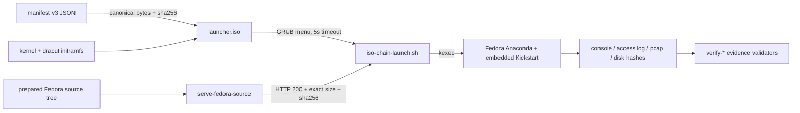

# Repository Guidelines

## Project Overview

This repository builds and exercises a bounded ppc64le (POWER9) optical bootstrap chain: a
`powerpc-ieee1275` GRUB ISO whose menu hands off to a dracut/systemd launcher that configures
static IPv4, downloads and SHA-256-verifies a fixed artifact set, and `kexec`s into the Fedora 44
text installer (Anaconda) with an embedded, authenticated Kickstart.

Two properties dominate every design decision:

- **No fallbacks.** There is no DHCP, no IPv6, no alternate profile, no alternate source, no HTTP
  redirect following, and no credential use. A run either proves the declared path or fails.
- **Evidence over assertion.** Success is only claimed through canonical record files that bind
  SHA-256 digests of console logs, HTTP access logs, packet captures, and disk images.

The chain is proven under QEMU pSeries/POWER9 only. Native PowerVM, HMC/VIOS mappings, firmware
security, and real P9 storage remain explicitly separate, unauthorized work.

## Architecture & Data Flow

One stdlib-only Python CLI drives preparation, construction, execution, and verification.



Stages, in order:

1. **Manifest v3** (`--config`) is the single source of truth. Exactly six top-level fields:
   `version`, `lpar`, `network`, `source`, `profiles`, `selected_profile`. `version` must be the
   integer `3`; profiles are limited to `distribution: "fedora"` / `release: "44"`, and the
   selected profile must exist in the map.
2. **Canonicalization.** `load_manifest_bytes()` emits
   `json.dumps(..., ensure_ascii=False, sort_keys=True, separators=(",", ":")) + "\n"` and returns
   its SHA-256. That digest is embedded in the ISO and bound into every kernel argument.
3. **Preparation.** `prepare-initramfs` runs dracut with `assets/dracut/` assets;
   `prepare-fedora-source` verifies a Fedora 44 DVD digest, extracts the tree, and writes
   `profile.json` for pasting into a private manifest.
4. **Construction.** `build` stages `/iso-chain/config.json`, `/boot/vmlinuz`,
   `/boot/initramfs.img`, and `/boot/grub/grub.cfg`, then calls `grub2-mkrescue`. GRUB uses
   `set timeout=5` and `set default="<selected_profile>"`. The kernel command line carries every
   profile's paths, sizes, and digests plus `ipv6.disable=1` and `rd.systemd.unit=iso-chain.target`,
   and must stay under 2,048 bytes.
5. **Execution.** `smoke` boots with a disposable snapshot overlay and stops before installation;
   `install-fedora` creates a fresh standalone qcow2, installs, then boots the disk with no ISO and
   no NIC.
6. **Verification.** `verify-log`, `verify-pcap`, `verify-launcher-log`, `verify-fedora-evidence`,
   and `verify-fedora-install-evidence` re-derive claims from canonical evidence records.

### Core code patterns

- **Frozen dataclass domain model:** `NetworkConfig`, `Artifact`, `Repository`, `InstallerProfile`,
  `Manifest`. `Manifest.profile()` allowlists lookups; nothing is mutable after parsing.
- **Hand-written strict validation, no schema library.** `_object_pairs` rejects duplicate JSON
  keys, `_manifest_object` enforces exact field sets, and small typed validators (`_string`,
  `_integer`, `_sha256`, `_identifier`, `_ipv4_address`, `_url_path`, `_validate_network`,
  `_validate_routes`, `_validate_dns`) enforce grammar and bounds.
- **One exception type.** `ValidationError(ValueError)` carries a user-facing message;
  `main()` prints `error: <message>` to stderr and returns exit code `2`. Uncaught `OSError`
  returns `1`; a failed child returns its own code. Invalid input must never echo private data.
- **No-replace, no-symlink filesystem policy.** Outputs use `open("xb")`, `os.open` with
  `O_EXCL`/`O_NOFOLLOW`, hard-link publication, and `_publish_directory()` calling libc
  `renameat2(..., RENAME_NOREPLACE)` on Linux or `renamex_np(..., RENAME_EXCL)` on Darwin through
  `ctypes`. Every artifact path must be a real regular file that does not already exist.
- **Bounded reads.** `MAX_*` constants cap manifests, command lines, treeinfo, Kickstart, logs,
  and install captures; anything over the limit is a validation failure, not a truncation.
- **Testable seams.** No DI framework: functions take `Path`, `Manifest`, `argparse.Namespace`,
  or raw `bytes` explicitly (`load_manifest_bytes`, `_kernel_arguments`, `_grub_config`,
  `qemu_command`, `install_qemu_commands`, `verify_launcher_log`, `verify_pcap`).
- **No logging module.** Results go to `stdout` via `print()`; evidence markers use fixed strings
  such as `ISO_CHAIN_EVIDENCE:` and `PASS_LINES`.

## Key Directories

- `scripts/` — `iso_chain.py`, the entire CLI (build, prepare, serve, run, verify).
- `tests/` — stdlib `unittest` suite plus a Bash launcher black-box test.
- `assets/dracut/` — guest launcher: `iso-chain-launch.sh`, `iso-chain-launch.service`,
  `iso-chain.target`, `iso-chain-fedora-stage2.sh`.
- `assets/kickstart/` — `fedora-44-power9.ks`, the reference unattended installation fixture.
- `docs/adr/` — ten accepted, binding ADRs (0001–0010).
- `docs/workflow/specs/` and `docs/workflow/plans/` — dated `YYYY-MM-DD-<slug>.md` design
  contracts and implementation plans; a spec and its plan share a date and slug.
- `docs/experiments/` — dated emulator evidence records with explicit boundaries.
- `docs/solutions/` — dated durable solution records (front matter plus Problem / Root cause /
  Solution / Prevention).

## Development Commands

Host prerequisites: macOS arm64 or x86_64 Linux, Python 3.14, `just` >= 1.57, and uv 0.12.12 or a
compatible release. Everything runs through `just`.

```sh
just setup                                              # .venv + hash-locked tools + Git hook
just check                                              # aggregate CI checks (non-mutating)
just fix                                                # ruff/rumdl fixes, then just check
just check-tests                                        # shell test, then unittest discovery
just build-image                                        # ISO build image (podman, else docker)
.venv/bin/pre-commit run --all-files                    # run every configured hook directly
.venv/bin/python -m unittest -v tests.test_iso_chain.ManifestV3Tests   # single test class
bash tests/test_iso_chain_launch.sh                     # shell launcher test alone
```

`just check` runs, in order: `check-justfile`, `check-whitespace`, `check-python-lint`,
`check-python-format`, `check-tests`, `check-markdown`, `check-secrets`.

Subcommands of `scripts/iso_chain.py`: `build`, `container-build`, `inspect`, `prepare-initramfs`,
`prepare-fedora-source`, `serve-fedora-source`, `validate-external-source`, `smoke`,
`install-fedora`, `verify-log`, `verify-pcap`, `verify-launcher-log`, `verify-fedora-evidence`,
`verify-fedora-install-evidence`. Every command prints argparse-generated help only; see
`README.md` for a full worked sequence of every stage.

## Code Conventions & Common Patterns

- **Formatting:** ruff, line length 100, `target-version = "py314"` in `pyproject.toml`. No custom
  lint rules, no Black, no type checker, no coverage tool. Markdown is linted by rumdl (also
  line length 100; code blocks and tables exempt).
- **Naming:** `snake_case` functions, `PascalCase` classes and dataclasses, `_`-prefixed internal
  helpers, `UPPER_CASE` module constants (`MAX_LOG_BYTES`, `PASS_LINES`, `FEDORA_ISO_SIZE`).
- **Typing:** annotate every function; use modern unions (`str | None`, `Path | None`) and
  `@dataclass(frozen=True)` for value objects.
- **Imports:** standard library only in `scripts/`; no third-party Python runtime dependency.
- **Error handling:** raise `ValidationError` with a message phrased for the operator; translate
  malformed input, missing paths, bad evidence, and subprocess/network failures before they escape.
- **Validate before acting:** reject non-canonical forms (MAC casing, IPv4 CIDR, URL paths), and
  prove inputs invalid before spawning any external command.
- **Determinism:** canonical JSON, sorted output, dracut `--reproducible`, and `--no-cache` on all
  checks. Re-running a check must never touch a repository file.
- **Security invariants:** public origins require HTTPS (HTTP is for loopback and controlled test
  servers); redirects, credentials, query strings, and fragments are rejected; artifact size and
  SHA-256 must match the manifest exactly.
- **Private data:** manifests, media, source trees, logs, access logs, disk hashes, and packet
  captures can carry machine or network identifiers. Keep them in private storage, use `umask 077`
  and fresh paths per run, and never commit them.

## Important Files

- `scripts/iso_chain.py` — entry point; `parser()` and `main()` are the only dispatch boundary.
- `assets/dracut/iso-chain-launch.sh` — guest-side contract: strict `iso_chain.*` argument
  parsing, exact-MAC selection, static IPv4, capacity checks, verified downloads, `kexec -l`,
  `kexec -e`.
- `assets/kickstart/fedora-44-power9.ks` — Fedora 44 fixture; destroys only `/dev/vda` and writes
  the `installed-boot: passed boot_id=...` completion marker.
- `Justfile` — source of truth for every check, setup, and fix command.
- `pyproject.toml` — ruff and rumdl configuration; note there is no `[project]` table.
- `.pre-commit-config.yaml`, `.githooks/pre-commit` — six local hooks that delegate to focused
  `just` recipes; `just setup` installs the launcher into the resolved Git hooks path.
- `.github/workflows/checks.yml` — one `checks` job whose matrix runs the same `just setup` and
  `just check` on `ubuntu-latest` and `macos-latest`, with a pinned uv action instead of a separate
  Python setup step.
- `docs/adr/0003`, `0004`, `0005`, `0006`, `0007` — the binding choices for GRUB+kexec bootstrap,
  the dracut launcher, the verified initramfs bundle, manifest v3, and external-source validation.
- `docs/adr/0008`, `0009`, `0010` — the macOS build container, the uv development environment, and
  portable no-replace publication.
- `docs/workflow/specs/2026-09-10-fedora-kickstart-install-design.md` and
  `2026-09-11-external-http-repository-design.md` — current contract for the manifest and the
  external repository path.
- `docs/solutions/2026-09-10-stream-subprocess-evidence-before-eof.md` — the solution-record
  format to follow when capturing a non-obvious fix.

## Runtime/Tooling Preferences

- **Python 3.14 is required** (`.python-version`, CI `python-version: "3.14"`). `pyproject.toml`
  declares no `requires-python`; the version file and lock are authoritative.
- **No runtime dependencies.** Development tools are pinned in `requirements-dev.in` and installed
  from the hash-locked `requirements-dev.lock` with `uv pip install --require-hashes`:
  `pre-commit==4.6.2`, `ruff==0.16.6`, `rumdl==0.2.66`, `detect-secrets==1.5.0`. The lock carries
  macOS arm64 artifacts as well as Linux x86_64 ones, and uv supplies CPython 3.14 when the host
  does not. Regenerating the lock is a separate review action.
- **`just` owns the command surface.** Focused recipes are invoked by both the local pre-commit
  hooks and CI; never duplicate a check command line in a hook or workflow (ADR 0001).
- **Checks are read-only.** Only `just fix` mutates files, and it re-runs the full check afterwards.
  `.secrets.baseline` records the line numbers of its false positives, so a change that grows or
  shrinks a file it covers must refresh those numbers in the same change — otherwise
  `check-secrets` rewrites its disposable baseline copy and fails. Adding or removing a recorded
  finding remains a separate review action, never part of check or fix.
- **Target build tooling is not installed by `just setup`:** `build` needs `grub2-mkrescue` and
  `xorriso` — `container-build` runs it inside the pinned `iso-chain-builder:44` image, choosing
  `podman` when it is on `PATH` and `docker` otherwise, which is how macOS builds the ISO —
  `prepare-initramfs` needs a ppc64le host with `dracut` and
  `/usr/lib/modules/<ver>`, and the run/verify commands need `qemu-system-ppc64`, `qemu-img`,
  `cpio`, `xz`, and `tcpdump`.
- **CI does not build or boot media.** Bootable-media validation requires a ppc64le emulator or
  real ppc64le hardware and is deliberately out of the automated pipeline.

## Testing & QA

- **Frameworks:** stdlib `unittest` (`tests/test_iso_chain.py`, fourteen test classes such as
  `ManifestV3Tests`, `BuildTests`, `ContainerBuildTests`, `InstallTests`, `FedoraEvidenceTests`,
  `PrepareTests`) plus the Bash black-box `tests/test_iso_chain_launch.sh`. No pytest, no conftest,
  no coverage threshold.
- **Run:** `just check-tests`, or `just check` for the full suite in CI terms. The local pre-commit
  hooks omit `check-tests`; only CI's aggregate `just check` runs it, so run `just check-tests`
  before shipping.
- **Python fixtures:** module factories `manifest_data(**changes)` (canonical v3 manifest) and
  `valid_log()` (boot evidence); each class builds a per-test temp directory via
  `Path(self.enterContext(tempfile.TemporaryDirectory()))` and local `args` namespace builders.
- **Mocking:** patch `scripts.iso_chain.subprocess.run` / `Popen` for external tools
  (`grub2-mkrescue`, `xorriso`, `cpio`, `xz`, `qemu-img`, `tcpdump`, `dracut`) and narrow seams
  like `shutil.disk_usage`, `os.open`, and `Path.open` for race and limit cases. `FedoraServerTests`
  and `ExternalSourceTests` start the real server on `127.0.0.1:0` and use `urllib` with timeouts.
- **Shell test harness:** the harness pins `LC_ALL=C` so the launcher sees the guest's locale, and
  `write_fake_commands` installs fake `ip`, `curl`, `kexec`, `sync`, `stat`, and `sha256sum` on
  `PATH`; the launcher runs against injected
  `ISO_CHAIN_SYS_CLASS_NET`, `ISO_CHAIN_RESOLV_CONF`, `ISO_CHAIN_CMDLINE`, `ISO_CHAIN_CALLS`,
  `ISO_CHAIN_FAULT`, `ISO_CHAIN_MEMINFO`, and `ISO_CHAIN_RUN_DIR`. Success prints exactly
  `launcher shell tests: passed`; failures print `test failure: <detail>` and exit 1.
- **Conditional skip:** `ExternalMirrorOptInTests` runs only when both `ISO_CHAIN_EXTERNAL_MIRROR`
  and `ISO_CHAIN_EXTERNAL_MANIFEST` are set; there is no implicit mirror.
- **Expectations for new tests:** add cases to the matching behavior class, cover boundary and
  canonical-form rejections, assert that invalid input never echoes private or untrusted values,
  and assert validation fails before any external command runs (`run.assert_not_called()`).
  Deterministic, isolated, and safe in the full suite.
- **Asset coupling:** `InstallTests` reads `assets/kickstart/fedora-44-power9.ks`;
  `PrepareTests` reads `assets/dracut/iso-chain-launch.service` and `iso-chain.target`; the shell
  test requires both dracut scripts to exist and be executable. Changing an asset without updating
  these tests will fail the suite.
